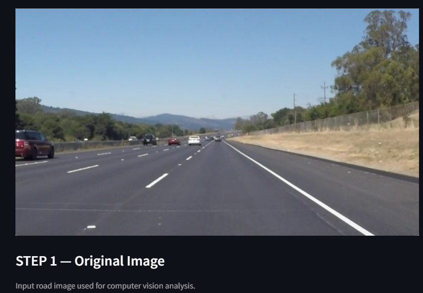
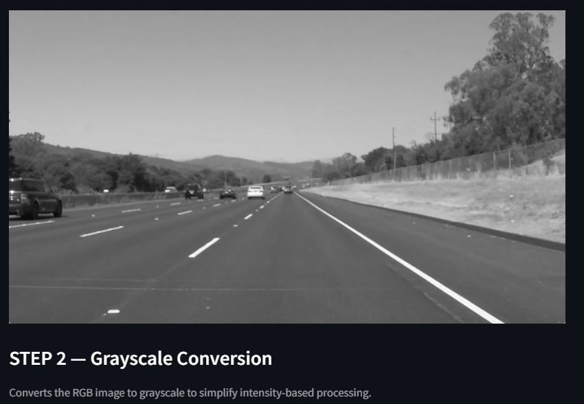
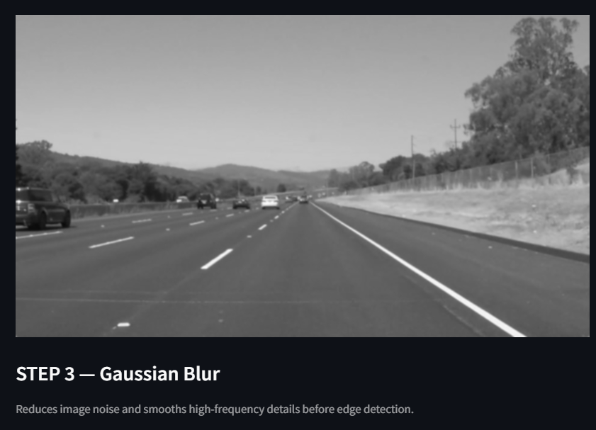
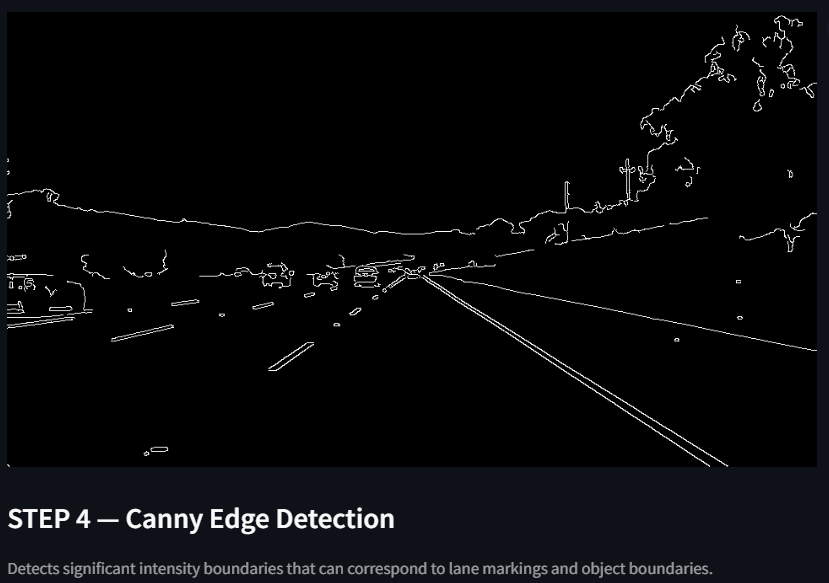
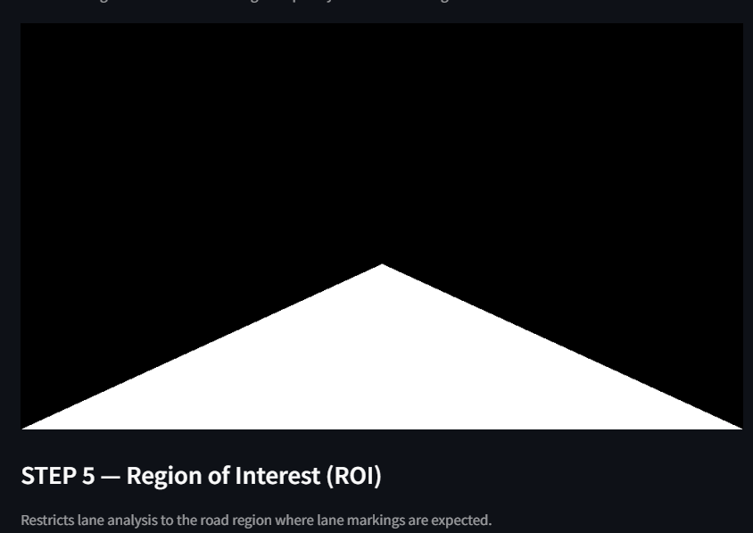
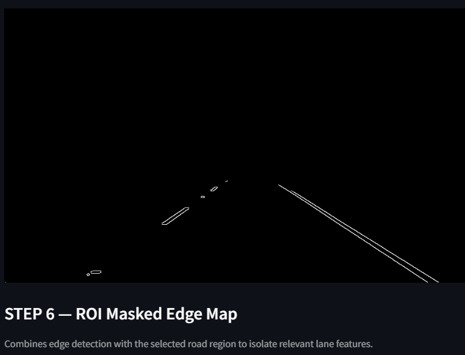
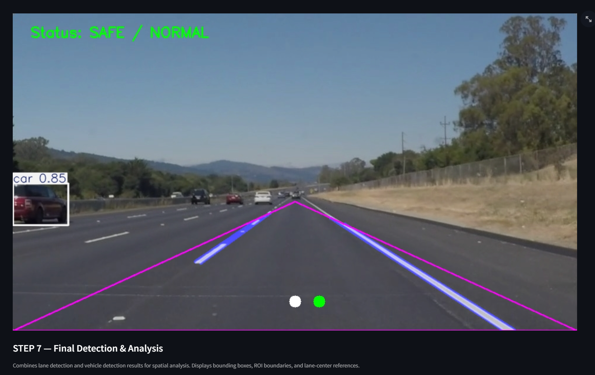

# 🚦 AI Road Safety Analyzer — Using Computer Vision

An academic project developed for **B.Tech Computer Science (AI & ML)**. This system processes road images and video frames to detect lane markings, identify vehicles using pretrained YOLO models, and estimate the ego-vehicle's lane positioning to issue real-time visual safety warnings.


---

## 📌 Overview

The **AI Road Safety Analyzer** combines classical computer vision techniques with a modern deep-learning object detector to build a lightweight, explainable road-safety pipeline. Given a road image (or video frame), the system:

1. Detects the **lane boundaries** the vehicle is traveling within.
2. Detects **vehicles** on the road using a pretrained YOLOv8 model.
3. Estimates the **ego-vehicle's position** relative to the detected lane center.
4. Displays a **live safety status** (e.g. `SAFE / NORMAL`) overlaid on the frame.

The project is built with **Python, OpenCV, Ultralytics YOLOv8, and Streamlit**, making it easy to run locally as an interactive web app.

---

## 🧠 Architecture & Computer Vision Theory

The pipeline is split into two parallel tracks — **lane detection** and **vehicle detection** — which are then fused for spatial safety analysis.

1. **Lane Detection Pipeline**
   `Grayscale Conversion → Gaussian Blur → Canny Edge Detection → ROI Masking → Hough Line Transform`
2. **Vehicle Detection**
   Uses **Ultralytics YOLOv8n (nano)** for fast, real-time bounding-box generation, targeting vehicle classes from the **MS COCO** dataset (car, truck, bus, motorcycle, etc.).
3. **Lane Position Analysis**
   Estimates the ego-vehicle's position (assumed to be the camera's horizontal center) relative to the mathematical average of the two detected lane boundaries, and flags a warning if the vehicle drifts too far from the lane center.

---

## 🖼️ Step-by-Step Pipeline (with Screenshots)

Below is a detailed, step-by-step walkthrough of exactly what the pipeline does to a single input frame, from the raw dashcam image to the final annotated safety output.

### Step 1 — Original Image

The raw, unprocessed input frame captured from a dashcam or road video, used as the starting point for all downstream computer vision processing.



---

### Step 2 — Grayscale Conversion

The RGB image is converted to grayscale. This reduces the image to a single intensity channel, simplifying downstream processing and making edge detection significantly faster and more robust to color variation.



---

### Step 3 — Gaussian Blur

A Gaussian blur is applied to the grayscale image to suppress high-frequency noise and fine texture (like gravel, tree leaves, or sensor grain). This smoothing step prevents the edge detector from picking up spurious, non-lane edges in the next stage.



---

### Step 4 — Canny Edge Detection

The Canny edge detector is applied to the blurred image to find significant intensity gradients — the boundaries between light and dark regions. These edges correspond to candidate lane markings, road boundaries, vehicles, and background objects such as trees and hills.



---

### Step 5 — Region of Interest (ROI) Mask

Since lane markings only ever appear in a specific triangular/trapezoidal region of the frame (the road surface ahead of the vehicle), a binary mask is generated to isolate that region and discard everything else — sky, trees, fences, and roadside clutter.



---

### Step 6 — ROI-Masked Edge Map

The Canny edge map (Step 4) is combined with the ROI mask (Step 5) using a bitwise AND operation. The result keeps only the edges that fall inside the road region, isolating the lane-marking candidates from all the irrelevant background edges.



---

### Step 7 — Final Detection & Safety Analysis

The final stage fuses everything together:

- **Lane lines** (detected via Hough Line Transform on the masked edge map) are drawn and extrapolated toward the horizon (magenta boundary lines with a blue lane-center strip).
- **Vehicles** are detected using YOLOv8n and rendered as labeled bounding boxes with confidence scores (e.g. `car 0.85`).
- The **ego-vehicle position** (white dot) is compared against the **computed lane center** (green dot) to determine lateral offset.
- A **safety status banner** (`Status: SAFE / NORMAL`, or a warning state when drifting/obstruction is detected) is overlaid on the frame.



---

## 📂 Project Structure

```
ai-road-safety-analyzer/
├── app/                 # Streamlit application (UI layer)
├── src/                 # Core computer vision pipeline (lane & vehicle detection logic)
├── run.py               # Entry point to launch the application
├── requirements.txt     # Python dependencies
├── .gitattributes
├── .gitignore
└── README.md
```

---

## ⚙️ Tech Stack

| Component        | Technology                          |
|-------------------|--------------------------------------|
| Language          | Python 3.9+                          |
| Web UI            | Streamlit                            |
| Computer Vision   | OpenCV                               |
| Object Detection  | Ultralytics YOLOv8n                  |
| Numerical Ops     | NumPy                                |
| Image Handling    | Pillow                               |
| Visualization     | Matplotlib                           |

---

## 🚀 Getting Started

### Prerequisites

- Python 3.9 or higher
- `pip` package manager

### Installation

```bash
# 1. Clone the repository
git clone https://github.com/ChetanDixit-0717/ai-road-safety-analyzer.git
cd ai-road-safety-analyzer

# 2. (Recommended) Create a virtual environment
python -m venv venv
source venv/bin/activate      # On Windows: venv\Scripts\activate

# 3. Install dependencies
pip install -r requirements.txt
```

### Running the App

```bash
python run.py
```

or, if `run.py` launches Streamlit internally, you can also run it directly with:

```bash
streamlit run run.py
```

Then open the local URL shown in your terminal (typically `http://localhost:8501`) to access the interactive dashboard, upload a road image/video, and view the lane detection, vehicle detection, and safety analysis overlays.

---

## ⚠️ Limitations

- Requires clear lane markings and good lighting conditions to perform reliably.
- Not calibrated to physical camera intrinsics — position offsets are **pixel-based estimations**, not real-world metric distances.
- The ego-vehicle center proxy assumes the camera is mounted perfectly centered on the dashboard.

---

## 🔭 Future Improvements

- Integration of **Kalman Filters** for temporal lane tracking (smoothing detected lane lines across video frames).
- **Perspective Transformation (Bird's Eye View)** for more accurate real-world distance estimation.
- A **custom fine-tuned YOLO model** for region-specific vehicles (e.g., auto-rickshaws, two-wheelers common on Indian roads).

---

## 👤 Author

**Name:** Chetan Prakash
**Registration Number:** 24BAI10532

---

## 📄 License

This project was developed for academic purposes as part of a B.Tech Computer Science (AI & ML) coursework submission.
